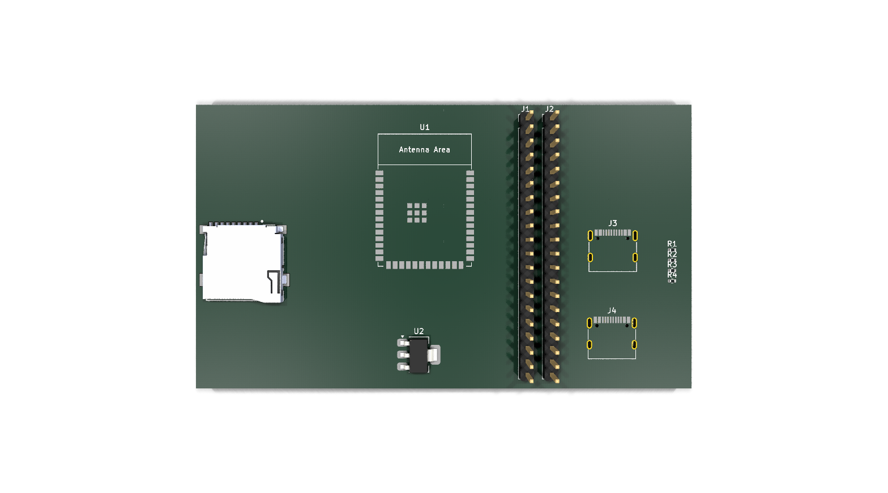
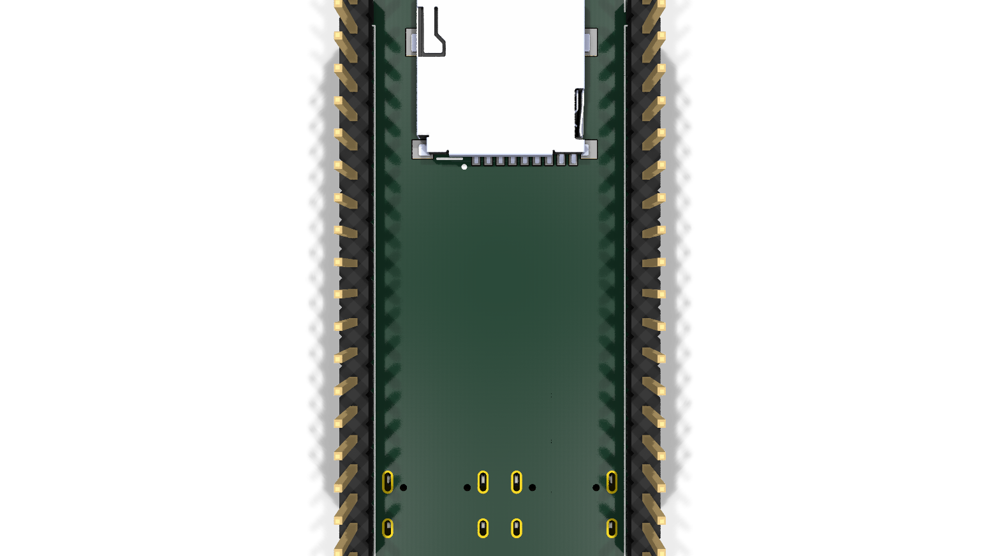

# Custom ESP32-S3 WROOM DevKit

This repo is for custom ESP32-S3 WROOM devkits, the plan is to add a ov5640 / ov2640 along with an SD card. Then use JLCPCB color printing to produce a colorful board that is also fit for MARS needs.

## Snapshot

This should remain up to date thanks to the CI workflow.

